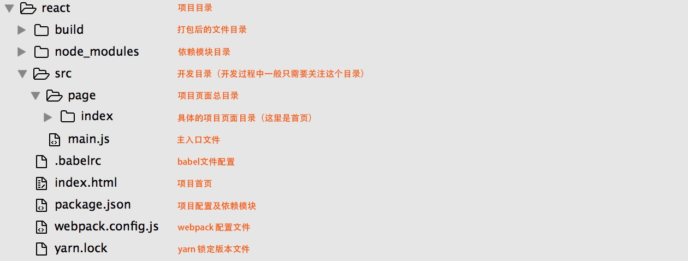

# 从0开始利用Webpack搭建React Demo
一般情况下，一个简单的React项目目录结构如下：


* 第一步：创建名为react-demo的项目目录，并且在根目录下创建项目首页index.html
```
<!DOCTYPE html>
<html>
<head>
	<meta charset="UTF-8">
	<meta name="viewport" content="width=device-width, initial-scale=1">
	<title>React Demo</title>
</head>
<body>
	<div id="app"></div>
	<script src="/build/bundle.js"></script>
</body>
</html>
```

* 第二步：初始化package.json文件（[package.json](http://javascript.ruanyifeng.com/nodejs/packagejson.html)介绍文档）
在项目根目录执行：`yarn init`
现在查看package.json 结果如下：
```
{
  "name": "react-demo",
  "version": "1.0.0",
  "main": "main.js",
  "author": "dragonishare",
  "license": "MIT"
}
```

并且初步安装开发时需要的第三方依赖react、react-dom、webpack、webpack-dev-server
```
yarn add react
yarn add react-dom
yarn add webpack --dev
yarn add webpack-dev-server --dev
```
此时package.json文件如下：
```
{
  "name": "react-demo",
  "version": "1.0.0",
  "main": "main.js",
  "author": "dragonishare",
  "license": "MIT",
  "dependencies": {
    "react": "^16.2.0",
    "react-dom": "^16.2.0"
  },
  "devDependencies": {
    "webpack": "^4.2.0",
    "webpack-dev-server": "^3.1.1"
  }
}
```
接下来配置script，当执行yarn run start或yarn run build执行时分别开启node服务器将项目跑起来，默认地址http://localhost:8080/
```
{
  "name": "react-demo",
  "version": "1.0.0",
  "main": "main.js",
  "author": "dragonishare",
  "license": "MIT",
  "dependencies": {
    "react": "^16.2.0",
    "react-dom": "^16.2.0"
  },
  "devDependencies": {
    "webpack": "^4.2.0",
    "webpack-dev-server": "^3.1.1"
  },
  "scripts": {
    "build": "webpack",
    "start": "webpack-dev-server"
  }
}
```
* 第三步：开始写main.js和page，参考react文档即可


## 参考
[从0开始利用Webpack搭建React Demo](https://zhuanlan.zhihu.com/p/28990057)

